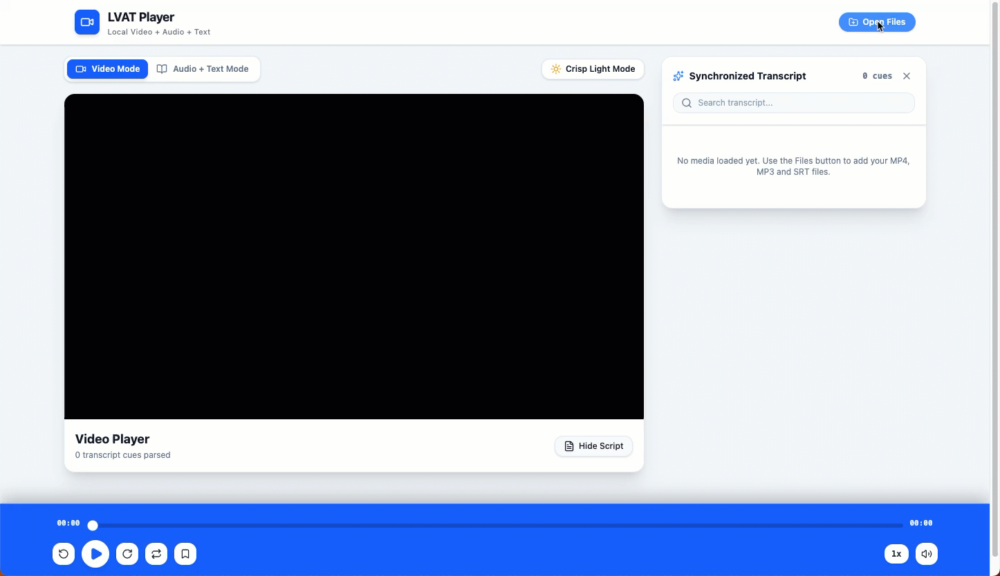

# LVAT Player. Local Video + Audio + Text

Interactive video and audio player with synchronized transcript reading. Load a local
media folder, pair it with SRT/VTT subtitles, and follow along with auto-scrolling
highlights on the active line.



## Features

- Video player with a synchronized, click-to-seek transcript
- Audiobook reader view with an always-on audio player bar
- SRT/VTT parsing, bookmarks, themes, and reader typography settings
- Local file/folder loading — nothing is uploaded anywhere

## Requirements

System installs:

| Tool                   | Version    | Notes                                                                        |
| ---------------------- | ---------- | ---------------------------------------------------------------------------- |
| **Node.js**            | >= 20      | Ships `npm` and `corepack`; both are used below                               |
| **pnpm**               | 11.1.2     | Pinned by `packageManager`. Install with `corepack enable pnpm`               |
| **Git**                | any recent | To clone the repo                                                             |
| **A modern browser**   | current    | Chrome or Edge recommended — see [Media codecs](#media-codecs)                |

`npm`/`npx` are required even though pnpm is the package manager: the `preinstall`
script runs `npx only-allow pnpm` to block `npm install` and `yarn install`. That
first run needs network access.

`esbuild` (a Vite dependency) compiles a native binary in a postinstall script.
pnpm 10+ blocks lifecycle scripts by default, but it is allowlisted in
`pnpm-workspace.yaml`, so no action is needed. If pnpm ever asks anyway, run
`pnpm approve-builds`.

Nothing else is needed locally — no ffmpeg, Python, or C/C++ build toolchain. All
media decoding and subtitle parsing happen in the browser.

## Run locally

```bash
corepack enable pnpm   # once per machine
pnpm install
pnpm dev
```

The dev server listens on port 3000 and binds `0.0.0.0`, so it is also reachable
from other devices on your network.

## Media codecs

The app hands files straight to the browser's `<video>`/`<audio>` elements, so
playback support is whatever your browser supports — there is no transcoding step.
Accepted extensions are `.mp4`, `.webm`, `.mov`, `.mp3`, `.m4a`, `.wav`, `.flac`,
plus `.srt`, `.vtt`, `.txt`, `.lrc` for text.

Coverage varies: Chrome, Edge, and Safari handle H.264/AAC in `.mp4` and `.mov`,
while Firefox and open-source Chromium builds may not, since they omit some
proprietary codecs. If a file loads but will not play, that is a browser codec
gap, not an app error — try it in Chrome or convert it to `.mp4` (H.264) or
`.webm` first.

## Scripts

| Script         | Description                        |
| -------------- | ---------------------------------- |
| `pnpm dev`     | Start the Vite dev server on :3000 |
| `pnpm build`   | Production build to `dist/`        |
| `pnpm preview` | Serve the production build locally |
| `pnpm lint`    | Type-check with `tsc --noEmit`     |
| `pnpm clean`   | Remove build output                |

## Stack

React 19 · TypeScript · Vite 6 · Tailwind CSS 4 · lucide-react · motion
